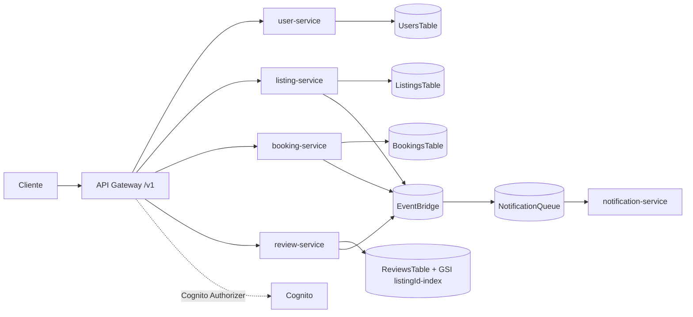
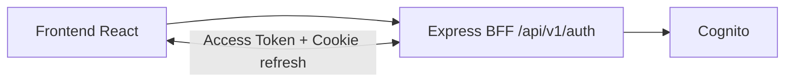
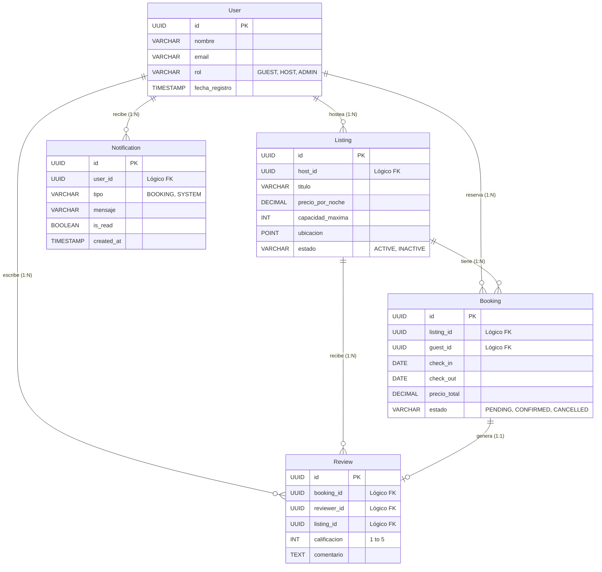
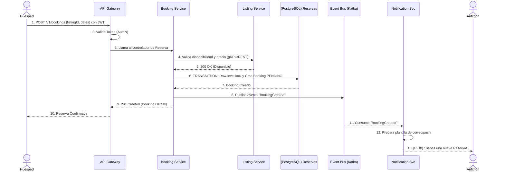
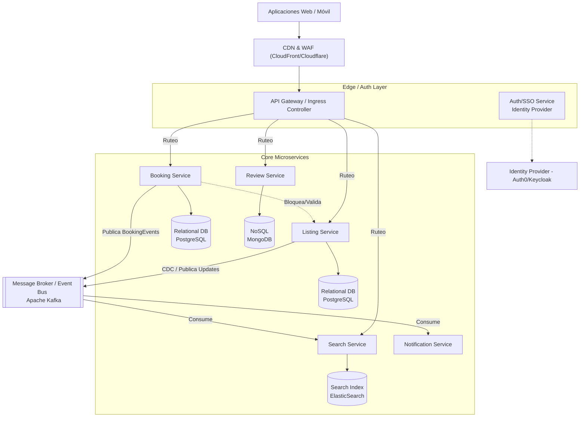
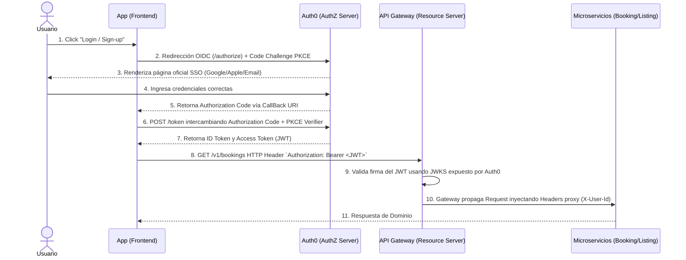

# Airbnb Group Services

Repositorio de **código de aplicación** para el proyecto académico de Airbnb (microservicios + BFF de autenticación + frontend).

Este repositorio **no contiene la infraestructura AWS**. La infraestructura se gestiona en un repositorio hermano ubicado al mismo nivel:

- `../airbnb_group_infrastruture` (nombre actual de carpeta)

## Qué contiene este repo

- Microservicios Lambda en `services/*`:
  - `user-service`
  - `listing-service`
  - `booking-service`
  - `review-service`
  - `notification-service`
- Contratos compartidos TypeScript en `shared/contracts`
- Contratos Smithy en `contracts/smithy`
- Backend BFF de autenticación (Express + Cognito) en `backend`
- Frontend React (Vite + Tailwind v4) en `frontend`

## Mapa rápido de carpetas

```txt
.
├── backend/                  # BFF Auth API (Express + Cognito)
├── contracts/smithy/         # Contrato Smithy (API de microservicios)
├── docs/                     # Documentación técnica
├── frontend/                 # UI web de autenticación
├── generated/                # Código generado (no fuente de verdad)
├── services/                 # Lambdas de dominio
├── shared/contracts/         # Tipos TS compartidos entre servicios
├── API_documentation.md      # Referencia de endpoints (BFF + microservicios)
└── Airbnb_Design_Document.md # Documento académico de diseño (alto nivel)
```

## Diagramas

### Arquitectura de microservicios



### Flujo BFF + Frontend



### Modelo de datos (ER)



### Flujo de reserva (secuencia)



### Diseño de alto nivel (componentes)



### Flujo de autenticación OIDC (secuencia)



## Prerrequisitos

- Node.js 20+
- npm 10+
- AWS CLI configurado (si vas a desplegar/probar en nube)
- AWS CDK (en el repo de infraestructura)

## Instalación

Desde la raíz de este repo:

```bash
npm install
```

Instalación adicional por módulo (si trabajarás en BFF/UI):

```bash
cd backend && npm install
cd ../frontend && npm install
```

## Comandos principales

En la raíz (`airbnb_group_services`):

```bash
npm run build
npm run test
```


Frontend (`frontend`):

```bash
npm run dev
npm run build
npm run preview
```

## Flujo con el repo de infraestructura

1. Desplegar infraestructura en `../airbnb_group_infrastruture` (`cdk deploy`).
2. Obtener outputs del stack (`ApiUrl`, `UserPoolId`, `UserPoolClientId`, etc.).
3. Configurar variables de entorno de `backend` y `frontend`.
4. Probar endpoints del BFF y endpoints `/v1/*` de API Gateway.

Guía completa: [`docs/INFRASTRUCTURE_INTEGRATION.md`](docs/INFRASTRUCTURE_INTEGRATION.md)

## Documentación disponible

- Arquitectura y estado actual: [`docs/ARCHITECTURE.md`](docs/ARCHITECTURE.md)
- Setup local: [`docs/LOCAL_SETUP.md`](docs/LOCAL_SETUP.md)
- Integración con repo infra: [`docs/INFRASTRUCTURE_INTEGRATION.md`](docs/INFRASTRUCTURE_INTEGRATION.md)
- Referencia API (BFF + microservicios): [`API_documentation.md`](API_documentation.md)
- Guía rápida de microservicios: [`README_airbnb_microservices.md`](README_airbnb_microservices.md)

## Notas de estado importantes

- `notification-service` consume mensajes SQS, pero actualmente su lógica es de logging (simulación).
- `listing-service`, `booking-service` y `review-service` publican eventos en EventBridge.
- El código actual de `user-service` **no publica** todavía `user.created`, aunque existe regla de infraestructura para ese evento.
- Existen carpetas de artefactos generados (`generated/`, `services/generated/`) que no son fuente canónica del dominio.
