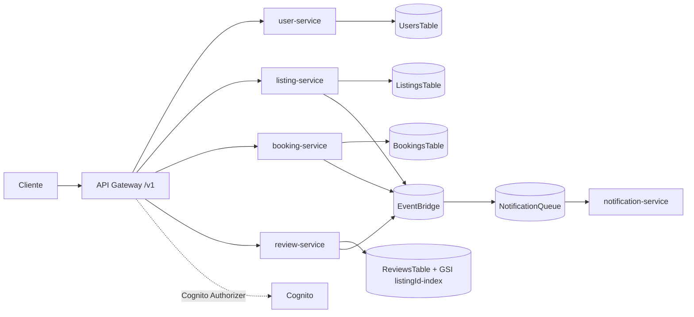
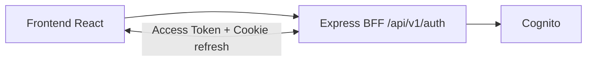

# Arquitectura del Proyecto

## 1. Vista general

El repositorio mezcla dos lineas funcionales que hoy coexisten:

1. **Linea microservicios (AWS Lambda + API Gateway + DynamoDB + EventBridge + SQS)**
2. **Linea BFF Auth + Frontend web (Express + Cognito + React/Vite)**

La infraestructura de AWS se define en un repositorio separado:

- `../airbnb_group_infrastruture`

## 2. Componentes principales

### 2.1 Microservicios (`services/*`)

- `user-service`: crea usuario interno usando email del JWT Cognito.
- `listing-service`: crea listings y publica `listing.created`.
- `booking-service`: crea reservas, consulta reserva por id, publica `booking.created`.
- `review-service`: crea reviews, lista reviews por listing, publica `review.created`.
- `notification-service`: consume mensajes SQS y hoy solo registra logs.

### 2.2 Backend BFF (`backend`)

API REST para autenticacion y sesion:

- `/api/v1/auth/register`
- `/api/v1/auth/confirm`
- `/api/v1/auth/login`
- `/api/v1/auth/refresh`
- `/api/v1/auth/logout`
- `/api/v1/auth/me`

El proveedor de identidad es AWS Cognito via SDK.

### 2.3 Frontend (`frontend`)

Aplicacion React con:

- pantallas de login/registro/confirmacion
- manejo de estado auth con Zustand
- `axios` con interceptores para refresh token

### 2.4 Contratos

- Contrato Smithy actual de microservicios: `contracts/smithy/models/airbnb.smithy`
- Tipos compartidos TS: `shared/contracts/src/index.ts`
- Existe un contrato Smithy adicional de diseno en `airbnb-smithy/` (linea academica/alterna)

## 3. Flujo de peticiones

### 3.1 Flujo microservicios

### 3.2 Flujo BFF + Frontend

## 4. Variables de entorno por modulo

### 4.1 `backend`

- `PORT`
- `AWS_REGION`
- `COGNITO_CLIENT_ID`
- `COGNITO_USER_POOL_ID`
- `JWT_SECRET_MOCK` (opcional)

### 4.2 `frontend`

- `VITE_API_URL` (default `http://localhost:3000/api/v1`)

### 4.3 `services/*`

- `user-service`: `USERS_TABLE`
- `listing-service`: `LISTINGS_TABLE`, `EVENT_BUS_NAME`
- `booking-service`: `BOOKINGS_TABLE`, `EVENT_BUS_NAME`
- `review-service`: `REVIEWS_TABLE`, `EVENT_BUS_NAME`
- `notification-service`: no vars obligatorias hoy

## 5. Estado real y observaciones

- La regla infra para `user.created` existe, pero `user-service` hoy no emite ese evento.
- `notification-service` no envia email/SMS; solo deja trazas.
- Hay artefactos generados en `generated/` y `services/generated/`; no son source of truth.
- El workspace raiz declara `infrastructure/cdk`, pero la infraestructura vive en repo separado.

## 6. Recomendaciones de evolucion

1. Alinear contrato Smithy, handlers y API docs de forma automatica.
2. Agregar pruebas para `listing-service`, `booking-service` y `review-service`.
3. Implementar productor `user.created` en `user-service`.
4. Definir runbook de despliegue conjunto app + infraestructura.

